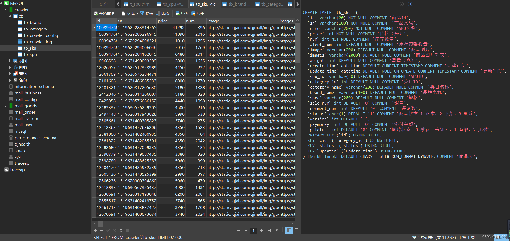
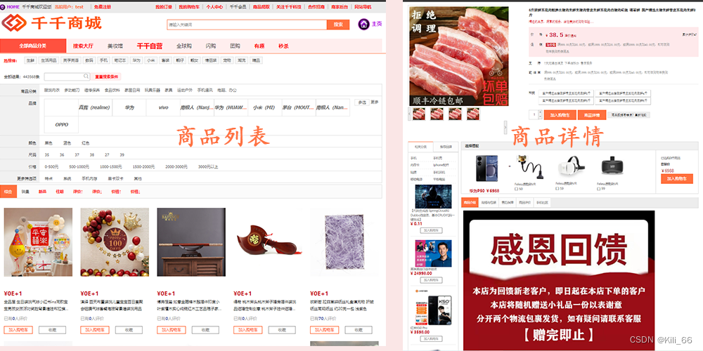

# Java爬虫爬取京东商品
本爬虫由站长一个人独立编写，由于Java爬虫相关文档少，写爬虫的时候踩到了许多坑，本文会配合视频逐一讲解。由于爬虫是结合自己做的电商项目，和同类爬虫相比做得还是比较细致的，项目共涉及6张表，表结构和爬取数据展示如下：

本爬虫支持爬取搜索页整个页面的spu（30条）和详情页的单个spu，爬取spu时会爬取对应的子商品。可以将爬取到的图片存储到本地或者七牛云，也可以都不存储，直接用第三方的链接，只需在application配置即可。爬取结果会有日志记录，对应表tb_crawler_log, 表中有个type字段代表爬取类型。0-定时任务爬取，1-爬取商品列表（30个spu)，2-爬取详情页spu, 3-更新爬取数据。其中type=3很实用，因为大的电商反爬做得比较严，爬取的数据肯定有部分异常的，当发现某个商品数据异常时，可以重新爬取并更新结果。本网站商品详情页有重新爬取，更新异常商品数据的功能。
### 博客教程:CSDN审核通过后发链接

### 视频教程
http://qjmall.lqjai.com/wsearch/100000616311?sourceType=6